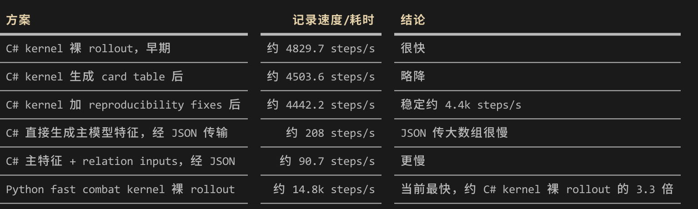

这篇是 “RL 解决杀戮尖塔” 专题的第一篇，也是强化学习真正开始折腾的第一个工作。

## 起点：环境

第一步先找一个合理的强化学习环境，这里就选择上网找了一个一般用于杀戮尖塔的环境https://github.com/zhiyue/sts2-rl-agent

但是存在的问题是，环境的做法是直接对照效果写的，会有很多隐藏问题，包括版本不够新。于是选择用dll 反编译+和原始环境对照，重点是对照随机数的设计等部分。这里首先只对齐了 seed 0 -100 选择随机合理的选项。很多分歧，修复到目前为止，没有必要完全实现 相同的环境，目的能够达到就可以。速度方面，和游戏dll 通信大致时间为


一开始的想法大概是直接利用生成的反编译C# 但是发现C#本身速度也很慢，于是还是选择 dll 对照+python 环境后续训练中会避免太复杂的困难的问题。然后直接使用默认的编码+PPO 开始训练。

环境的细节说明：


## 第一阶段只做战斗

完整爬塔太大，第一阶段可以只做战斗环境。也就是固定初始牌组、固定敌人池，先让 agent 学会在战斗中打合法牌。

这个阶段的状态可以包含：

1. 玩家血量、格挡、能量
2. 手牌、抽牌堆、弃牌堆
3. 敌人血量、格挡、意图
4. 当前回合数
5. 可执行动作 mask

先不追求信息完美。只要状态足够支持一个简单策略，就可以开始跑 baseline。

## 状态表示

状态表示需要在“完整”和“可训练”之间折中。

如果直接把所有游戏对象都塞进去，模型输入会很乱。卡牌有名称、费用、伤害、格挡、效果、升级状态；敌人有意图、buff、debuff；遗物又会改变规则。信息太多时，模型不一定学得更好，调试还会更痛苦。

我会先使用结构化向量：

```text
player_features:
  hp
  max_hp
  block
  energy

enemy_features:
  hp
  block
  intent_type
  intent_value

card_features:
  card_id
  cost
  type
  damage
  block
  playable
```

这里的重点是保持稳定。每个字段的含义、范围和归一化方式都要固定，否则训练曲线很难解释。

## 动作空间

战斗动作看起来简单：打牌或结束回合。但实际要处理几个细节：

- 有些牌需要选择目标
- 有些牌因为能量不够不能打
- 有些牌当前没有合法目标
- 一回合可以连续打多张牌
- 结束回合也是一个动作

一个可用的动作设计是：

```text
action = {
  action_type: play_card | end_turn
  card_index: 手牌位置
  target_index: 敌人位置
}
```

然后用 action mask 屏蔽非法动作。这样 agent 不需要自己试错大量无效动作，训练会稳定很多。

## Reward 先保持克制

第一版 reward 不应该太花。可以先这样设：

```text
胜利：+1
失败：-1
每场战斗损失生命：小幅惩罚
每回合造成伤害：小幅奖励
非法动作：强惩罚，或直接 mask 掉
```

这里最危险的是过度 reward shaping。比如给“造成伤害”太高的奖励，agent 可能只学会莽伤害，不管防御和长期生命值。给“保留血量”太高的奖励，它又可能过度防守。

所以第一阶段我会先用简单 reward 跑通，再逐步观察策略行为，而不是一开始就把所有直觉都塞进奖励函数。

## Episode 怎么结束

战斗阶段的 episode 结束条件很明确：

1. 敌人全部死亡，胜利
2. 玩家生命值归零，失败
3. 回合数超过上限，判定失败或截断

第三条很重要。如果没有回合上限，某些 bug 可能导致训练卡住。比如 agent 一直结束回合，或者敌我双方都无法结束战斗。

## 第一批 baseline

在训练模型前，我会先写三个 baseline：

1. 随机合法动作
2. 优先打出所有能打攻击牌
3. 简单防御策略：敌人要攻击时优先堆格挡

这些 baseline 不需要聪明，它们的作用是校验环境。如果随机策略都能异常高胜率，可能 reward 或敌人逻辑有 bug。如果简单启发式策略跑不过随机策略，动作编码或评估脚本就要重点检查。

## 当前实现顺序

我准备按这个顺序推进：

1. 先实现一个简化战斗环境
2. 写 action mask 和随机合法动作 baseline
3. 加入启发式 baseline
4. 记录胜率、平均回合数、平均损血
5. 再接 PPO 训练

这个顺序比较慢，但能减少后期返工。强化学习项目一旦环境和评估没打牢，后面每次实验失败都不知道该怪算法、参数，还是环境本身。

## 小结

RL 解决杀戮尖塔的第一步，不是训练一个大模型，而是定义一个可靠环境。对这个项目来说，状态、动作、reward、episode 结束条件和 baseline 是第一层地基。

下一篇我会继续拆动作空间，重点记录 action mask、组合动作和非法动作处理。
